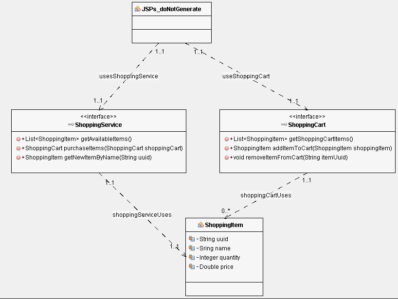
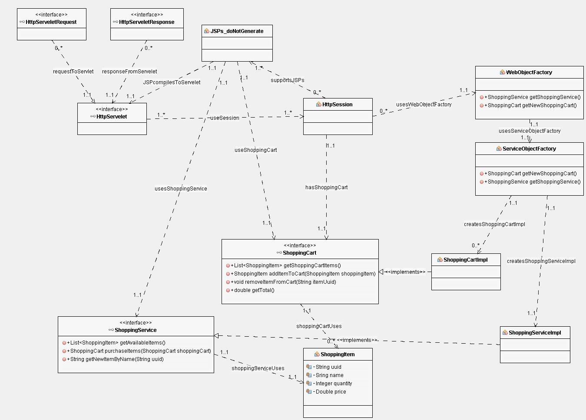
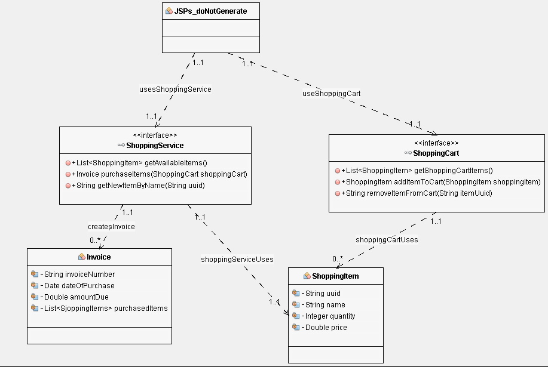
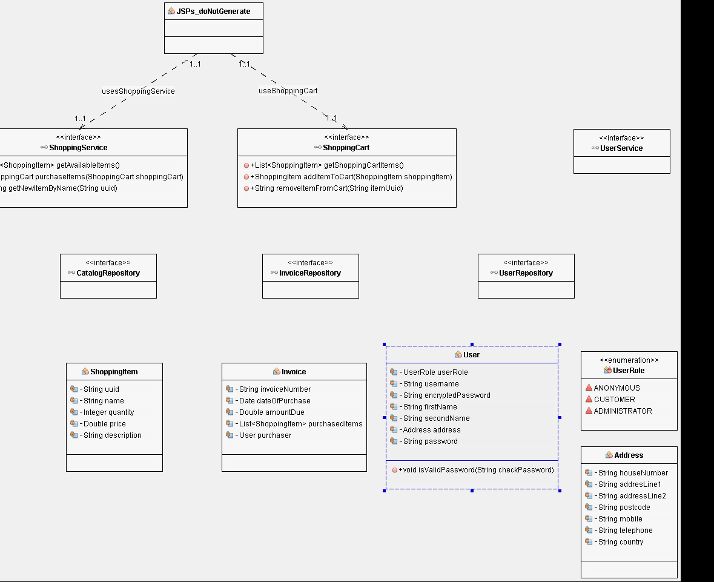
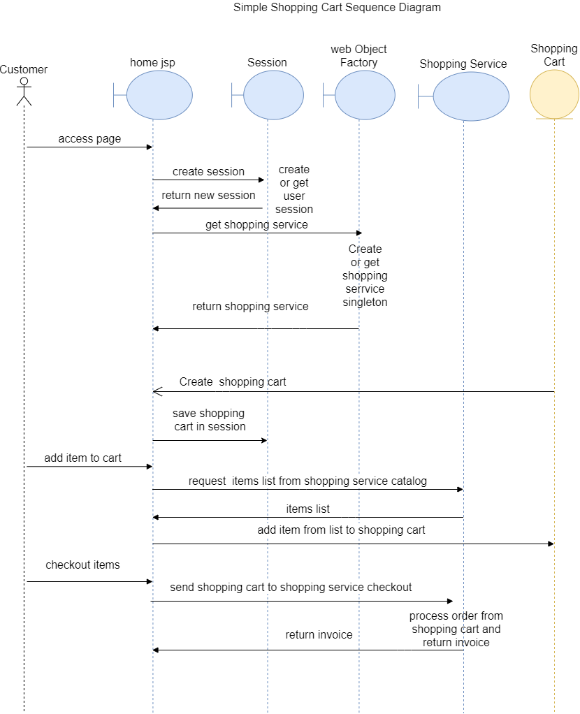
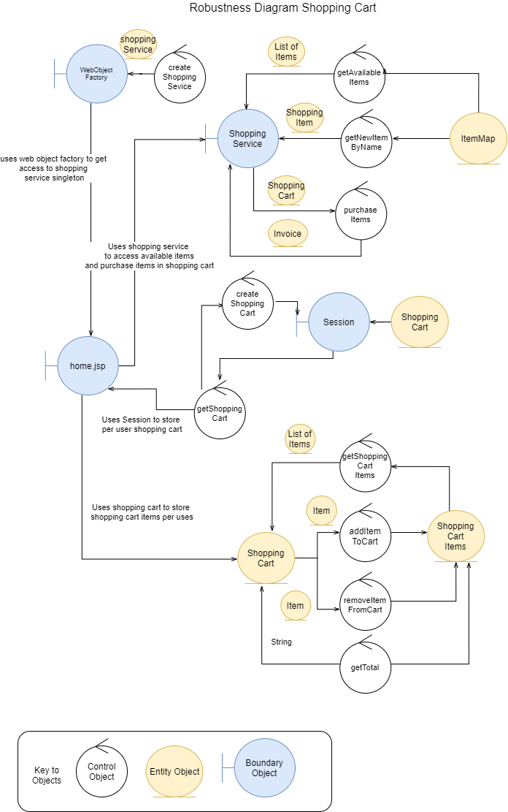

# Features

### Home View

- Full item list
- Add / Remove items
- See total / go to cart

### Orders View

N/A

### Catalog View (Admin only)

- View all items
- Edit/Delete/View items

### Cart View

- View added items
- View total
- Enter card details
- Money is taken

### Users

- Create user
- Login to user
- Update user
- Update other user details (admin only)

# Use Cases

User access level:

`Everyone` - A visitor who is not logged in.

`Customers` - A user who is logged in.

`Disabled` - A user who is banned from making new orders.

`Admins` - A user with admin rights.

| ID    | Role     | Action | Outcome |
| ----------- 	| ---------- | ----------- | ----------- |
| UC1            | Everyone  | Visits the site | Home page displaying items |
| UC2            | Customers  | User adds item | Item is added to cart or quantity is increased by one
| UC3            | Customers  | User removes item | Item is removed |
| UC4            | Customers  | User signs in  | User is logged in |
| UC5            | Customers  | User signs up  | User is registered |
| UC6        | Admins  | Admin views all users  | Admin can see all users |
| UC7            | Admins  | Admin modifies a user | User's details are updated  |
| UC8            | Customers  | User logs out  | User is logged out |
| UC9            | Disabled  | User attempts to login  | Items can not be added |

## Class Diagram

## Use Case Diagram

## Robustness Diagram

## Sequence Diagram

    